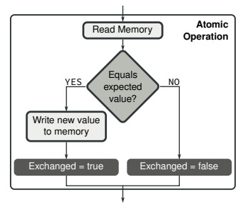

# **O Problema dos Leitores/Escritores**

**Autores**
- Beatriz Martins;
- Kevyn Marques;
- Maristella Rangel.

Se preferir, o documento também está disponível no Google Colab, o que permite a execução dos códigos das soluções: https://colab.research.google.com/drive/1BRJhLQIrG8G6WDuf7y4-gWSxolNyCOwB?usp=sharing

---

**Introdução**

O problema dos leitores/escritores é um clássico da programação quando se trata de sincronização de tarefas. Essa questão tem ocorrência em todo caso que envolve threads acessando de forma concorrente um mesmo arquivo, ou estrutura de dados, tanto para escrever sobre esse objeto quanto para lê-lo, o que gera uma condição de corrida, já que pode haver um caso onde uma tarefa solicita a leitura de um vetor de números, enquanto outra tenta escrever sobre esse mesmo vetor.
Nesse mesmo contexto, faz-se necessário tratar os trechos de código das tarefas que fazem uso dos recursos compartilhados, trechos esses que são chamados de região crítica, exigindo um controle de acesso ao recurso, permitindo ou não o uso simultâneo do mesmo, dependendo da solicitação (leitura ou escrita).

# **Mecanismos usados na solução do problema leitores/escritores: mutexes e semáforos (+ conceito de atomicidade)**

A programação multitarefa trouxe a necessidade do compartilhamento de dados entre processos, o que gerou alguns obstáculos, como por exemplo a carência da sincronização da execução das tarefas, o isolamento de áreas de dados protegidas e uma divisão eficiente dos recursos disponíveis, assim como a limitação desses recursos, o que deu origem a um mecanismo chamada semáforo. Surge juntamente com a programação multitarefa o problema relacionado a acessos múltiplos e concorrentes a um mesmo recurso. Um processo lendo um conjunto de dados da memória ao mesmo tempo que um outro processo atualiza esses dados, gera um erro, o que torna a leitura inválida e produz um resultado diferente do esperado, o que fez necessário o desenvolvimento de uma ferramenta de sincronização de tarefas, assim como os ***semáforos***, chamada ***mutex***.

---

### **Semáforos**

Assim como citado anteriormente, uma solução para o gerenciamento de recursos compartilhados são os semáforos. Um semáforo é um mecanismo de sincronização de tarefas, utilizado para bloquear tarefas quando um recurso não está disponível, realizando isso através de um contador (int) que pode representar a quantidade de recursos presentes no sistema em questão, ou se uma condição específica está satisfeita. Em sua aplicação, o semáforo pode ser inicializado com qualquer valor, mas posterior a sua criação as únicas modificações que devem ser feitas são de incremento e decremento, além disso, uma fila também torna-se necessária, para permitir o armazenamento dos descritores daquelas tarefas que foram bloqueadas por conta da indisponibilidade do recurso, a fim de permitir suas respectivas retomadas no momento da liberação do recurso.

*Obs: Exemplo didático e prático. A implementação real pode, e deve, conter funções mais abstratas e com orientação a testes, evitando permitir acesso direto à variável utilizada na composição do semáforo e modificações indevidas.*

```C++
//Criação e inicialização de um semáforo
int sem_imp;			    //Inteiro contador
sem_imp = 3;			    //Atribuição de um valor para o semáforo, que pode significar, por exemplo, a quantidade de impressoras disponíveis para uso em um escritório

//Função que permite uma impressão
void imprimir(x){		    //Consideremos x um objeto que possui todos os dados necessários para uma impressão
	if(sem_imp > 0){	    //Se há impressora disponível
		sem_imp--;		        //Reserva o recurso
        [...]                   //{Código para a realização efetiva da impressão}
		sem_imp++;		        //Libera o recurso
        [...]                   //{Código para o desbloqueio de uma tarefa, se houver, da fila desse semáforo}
        [...]                   //{Código para o acionamento do escalonador para definir a próxima tarefa a ser executada}
	}
	else{			        //Se não há impressora disponível
		[...]                   //{Código para o salvamento do contexto da solicitação de impressão}
        [...]                   //{Código para o envio da solicitação de impressão para a fila desse semáforo}
        [...]                   //{Código para o acionamento do escalonador para definir a próxima tarefa a ser executada}
	}
}

//Basicamente quando temos impressoras disponíveis a solicitação segue seu fluxo
//e o recurso é alocado, enquanto, se não há recursos a solicitação é bloqueada
//e enviada para uma fila, tendo sua retomada em algum momento a partir da
//liberação e *waking por parte da execução de uma solicitação corrente.
```

---

### **Mutexes**

Tal qual os semáforos, um mutex se trata de uma estrutura usada como mecanismo de sincronização de tarefas. Geralmente inicializados com 1, indicando que um recurso está liberado, o mutex vai trabalhar de forma binária, sinalizando que o recurso está alocado quando seu valor for 0. Em sua aplicação, o recurso associado ao mutex só pode ser liberado pela tarefa que o bloqueou, além disso, uma fila também torna-se necessária, para permitir o armazenamento dos descritores daquelas tarefas que foram bloqueadas por conta da indisponibilidade do recurso, a fim de permitir suas respectivas retomadas no momento da liberação do recurso.

*Obs: Exemplo didático e prático. A implementação real pode, e deve, conter funções mais abstratas e com orientação a testes, evitando permitir acesso direto à variável utilizada na composição do mutex e modificações indevidas.*

```C++
//Criação e inicialização de um mutex
int mut_pot;			    //Inteiro contador
mut_pot = 1;			    //Atribuição do valor 1 para o mutex, sinalizando que o recurso está liberado,
							//recurso esse que pode estar associado, por exemplo, ao controle da potência de uma hélice

//Função que permite o controle da potência de uma hélice
void potencia(x){		    //Consideremos x um objeto que possui todos os dados necessários para definir a potência de uma hélice
	if(mut_pot > 0){	    //Se a hélice não está alterando a sua potência
		mut_pot--;		        //Reserva o recurso
		[...]                   //{Código para a realização efetiva da mudança de potência}
		mut_pot++;		        //Libera o recurso
		[...]                   //{Código para o desbloqueio de uma tarefa, se houver, da fila desse mutex}
		[...]                   //{Código para o acionamento do escalonador para definir a próxima tarefa a ser executada}
	}
	else{			            //Se a hélice está alterando a sua potência
		[...]                   //{Código para o salvamento do contexto da solicitação de mudança de potência}
		[...]                   //{Código para o envio da solicitação de mudança de potência para a fila desse mutex}
		[...]                   //{Código para o acionamento do escalonador para definir a próxima tarefa a ser executada}
	}
}

//Basicamente quando temos a hélice disponível para alterar sua potência a
//solicitação segue seu fluxo e o recurso é alocado, enquanto, se não há
//disponibilidade a solicitação é bloqueada e enviada para uma fila, tendo
//sua retomada em algum momento a partir da liberação e *waking por parte
//da solicitação corrente.`
```

---

### **Instruções Atômicas**

Se uma tarefa verifica que um recurso único está disponível, mas logo ocorre uma interrupção e outra tarefa entra em execução, verificando o mesmo recurso, o que pode acontecer é um bloqueio por essa segunda tarefa, mas na retomada da primeira, mesmo que o recurso esteja indisponível, ela pode continuar seu fluxo de execução, tendo em vista que uma verificação foi realizada mas a atualização da disponibilidade do recurso não. Percebe-se que não houve o bloqueio do recurso por parte da primeira tarefa, portanto, na verificação da segunda tarefa o recurso será verificado e utilizado, podendo gerar problemas caso haja outra troca de contexto e a retomada da primeira tarefa. Portanto, as verificações dos contadores associados aos mutexes e semáforos devem ocorrer de forma atômica juntamente com a mudança dessas variáveis, isto é: o código que realiza a verificação não pode ser executado sem que as instruções relacionadas a alteração do valor da variável ocorra. O termo atômico é utilizado para dar sentido de indivisibilidade dessas operações. TSL, Test and Set Lock é uma instrução de implementação que pode ser utilizado nesses casos, realizando a verificação e mudança necessária da variável no mesmo momento.

*Obs: Exemplo didático e prático. A implementação real depende de cada máquina e sua linguagem, sendo o exemplo a seguir em linguagem montadora(assembly) baseada em uma arquietetura x86.*

```Assembly_x86
; Inicializações
section .data           ; Definindo uma área de dados
  lock byte 1           ; Variável de bloqueio inicializada com 1, sinalizando que o recurso está disponível

section .text           ; Criação de uma seção para o código executável
global _start           ; Deifnindo um ponto de partida do programa

_start:                 ; Procedimento inicial padrão
    mov eax, 0          ; Define o valor do registrador eax como 0
    mov ebx, lock       ; Carrega o endereço da variável lock no registrador ebx

try_lock:
    xchg eax, [ebx]     ; Carrega eax de acordo com o valor do bloqueador, referenciado por seu endereço contido em ebx.
                        ; Isso tudo de forma atômica através de uma Load-Link Instruction (explicações na sequência)
                              ; + Nessa instrução, se o valor original de lock era 1 (recurso desbloqueado), eax será 0
                              ; + após a troca (sinalizando que o recurso foi alocado, pois estava desbloqueado), e lock
                              ; + será 1 (recurso bloqueado). Entretanto, se o valor original de lock era 1 (recurso bloqueado),
                              ; + eax será 1 após a troca (sinalizando que o recurso não foi alocado, pois estava bloqueado).
    test eax, eax       ; Apenas verificando o sucesso da alocação do recurso/bloqueio
    jz got_lock         ; Se a alocação foi bem sucedida executa "got_lock"

    jmp try_lock        ; Se a alocação foi malsucedida executa "try_lock" novamente

got_lock:
    [...]               ; Seção crítica da tarefa
    mov byte [lock], 1  ; Libera o recurso alocado ajustando o bloqueador para 1

    [...]               ; Finalização do programa

; Vale lembrar que "xchg" é uma instrução atômica, ou seja, a verificação e
; alteração de valores das variáveis envolvidas ocorre no mesmo instante,
; considerando o mundo físico, pensemos em barramentos conectados de forma
; imedata para permitir a execução exemplificada na imagem a seguir em
; um único ciclo de execução. Portanto, ou toda a verificação e atualização
; de valores são realizadas, ou nada é executado.
```



# **Solução Tradicional**

### **Lógica**

* **Inicialização da solução:**

  Após a inclusão das bibliotecas necessárias e a definição de constantes usadas posteriormente, são declaradas variáveis globais: um contador para o número de leitores que estão acessando o recurso (*numLeitores*), um mutex para controlar o acesso a esse contador (*mutex*) e um semáforo para controlar o acesso ao recurso compartilhado (*semafaroRecurso*), no exemplo, a variável inteira *variavelCompartilhada*.


* **Função escritor** (Função a ser executada pelas threads escritoras)

  Um escritor espera no semáforo (sem_wait) até que o recurso esteja livre, ou seja, a execução do escritor é bloqueada até que o semáforo tenha um valor maior que zero. Quando o semáforo tem valor zero, significa que o recurso está sendo acessado (indisponível).

  Depois, o escritor entra em sua região crítica e manipula o recurso (altera a variável compartilhada). Por fim, o recurso é liberado (sem_post), ou seja, se houver escritor ou leitor na fila do semáforo, a tarefa será acordada e o escalonador será chamado. Caso contrário, o contador do semáforo é apenas incrementado.
  

* **Função leitor** (Função a ser executada pelas threads leitoras)

  A chamada pthread_mutex_lock bloqueia o mutex para garantir que apenas um leitor por vez possa modificar a variável *numLeitores*.

  Depois, o contador é incrementado, indicando que um novo leitor está acessando o recurso compartilhado. A verificação *numLeitores == 1* é usada para saber se o leitor é o primeiro a acessar o recurso compartilhado. Se for, é necessário bloquear qualquer escritor que queira acessar o recurso, usando o semáforo (sem_wait). Após a verificação, o mutex é liberado.

  O leitor então entra em sua região crítica e lê a variável compartilhada.

  Após essa etapa, o mutex é bloqueado novamente para possibilitar o acesso e
  a modificação da variável global *numLeitores*. O contador é decrementado e é feita uma verificação, *numLeitores == 0*, para saber se este é o último leitor a acessar o recurso. Se for, é necessário liberar o acesso ao recurso compartilhado para escritores, desbloqueando o semáforo (sem_post). Por fim, o mutex é desbloqueado novamente.


* **Função main**

  Primeiramente, são criados dois vetores para armazenar, respectivamente, os identificadores das threads leitores e escritores. Em seguida, é feita a inicialização do semáforo, com o valor 1, indicando que o recurso compaertilhado está inicialmente disponível.

  Depois, são criados leitores e escritores, dentro de loops, usando a chamada *pthread_create*. Após a criação de todas as threads, é necessário esperar que todas sejam concluídas, usando a chamada *pthread_join* em um loop para os leitores e um para os escritores.

  Por fim, os recursos utilizados são liberados através das chamadas *pthread_mutex_destroy* e *sem_destroy*.

```C++
#include <stdio.h>
#include <pthread.h>
#include <semaphore.h>
#include <stdlib.h>
#include <unistd.h>

#define N_ESCRITORES 4
#define N_LEITORES 6

// Declarações globais
int numLeitores = 0;
pthread_mutex_t mutex = PTHREAD_MUTEX_INITIALIZER;      // Inicializa um mutex com os atributos padrão
sem_t semafaroRecurso;
int variavelCompartilhada = 0;

// Escritores
void* escritor(void *arg){
  pthread_t tid = pthread_self();                       // Obtém ID da thread

  sem_wait(&semafaroRecurso);

  // Região crítica
  variavelCompartilhada++;
  printf("Escritor %lu escreveu: %d\n", tid, variavelCompartilhada);

  sem_post(&semafaroRecurso);
  printf("Escritor %lu liberou recurso\n", tid);
}

// Leitores
void* leitor(void *arg){
  pthread_t tid = pthread_self();                       // Obtém ID da thread

   pthread_mutex_lock(&mutex);
   numLeitores++;
   if(numLeitores == 1){                                // O primeiro leitor a usar o recurso compartilhado bloqueia o escritor
      sem_wait(&semafaroRecurso);
   }
   pthread_mutex_unlock(&mutex);

   // região crítica
   printf("Leitor %lu leu : %d\n", tid, variavelCompartilhada);
   sleep(5);                                            // Apenas para melhor visualização na execução

   pthread_mutex_lock(&mutex);
   numLeitores -= 1;
   if(numLeitores == 0){                                // O último leitor a usar o recurso compartilhado
      sem_post(&semafaroRecurso);
   }
   pthread_mutex_unlock(&mutex);
  printf("Leitor %lu liberou recurso\n", tid);
}

int main(){
    pthread_t read[N_LEITORES], write[N_ESCRITORES];

    // Inicializa o semáforo
    sem_init(&semafaroRecurso, 0, 1);

    // Criando leitores
    int resultado;

    for(int t = 0; t < N_LEITORES/2; t++){
        printf("Criando %d º leitor\n", t+1);

         resultado = pthread_create(&read[t], NULL, leitor, NULL);

        if(resultado){
            printf("Erro ao criar thread!\n");
            exit(1);
        }
    }

    // Criando escritores
    for(int t = 0; t < N_ESCRITORES; t++){
        printf("Criando %d º escritor\n", t+1);

        resultado = pthread_create(&write[t], NULL, escritor, NULL);

        if(resultado){
            printf("Erro ao criar thread!\n");
            exit(1);
        }
    }

    // Criando mais leitores
    for(int t = (N_LEITORES/2); t < N_LEITORES; t++){
      printf("Criando %d º leitor\n", t+1);

      resultado = pthread_create(&read[t], NULL, leitor, NULL);

      if(resultado){
            printf("Erro ao criar thread!\n");
            exit(1);
        }
    }

    // Espera todas as threads concluírem
    for (int t = 0; t < N_LEITORES; t++){
        pthread_join(read[t], NULL);
    }

    for(int t = 0; t < N_ESCRITORES; t++){
        pthread_join(write[t], NULL);
    }

    // Libera o mutex e o semáforo
    pthread_mutex_destroy(&mutex);
    sem_destroy(&semafaroRecurso);

    printf("FIM do programa\n");

    return 0;
}
```

---

### **Limitação da solução: *starvation* com os escritores**

Essa solução está sujeita ao problema de **starvation** (como um tipo de inanição), nesse caso, com os escritores. Isso significa que um escritor pode ficar bloqueado por um período de tempo muito longo, enquanto leitores acessam suas respectivas regiões críticas.

A inanição pode ocorrer em um cenário no qual há leitores constantemente solicitando acesso ao recurso, ou seja, entrando em suas regiões críticas, de forma que se um escritor tentar acessá-la, será bloqueado até que todos os leitores terminem, às vezes disputando também com outros escritores, possivelmente por conta da baixa prioridade da tarefa.

Portanto, essa disputa contínua de acesso e problema de prioridade acaba gerando esse cenário que possibilta a inanição de escritores, podendo ser resolvido com, por exemplo, as seguintes soluções:
* Políticas de equidade: utilizar uma fila, por exemplo, ou uma estrutura sequencial para que todo acesso seja realizado em algum momento.
* Controladores dinâmicos de conexão: implementar algoritmos avançados de controle de conexão que balanceiem dinamicamente o número de acessos entre threads leitoras e escritoreas.
* Prioridade dinâmica: ajustar dinamicamente as prioridades das threads com base no tempo de espera, garantindo que nenhuma thread seja bloqueada por muito tempo.

---

# **Solução: Mutexes e semáforos sem Starvation** (No-starve readers-writers solution)

### **Lógica**

* **Inicialização da solução:**

  Considerando que esta solução é uma modificação da solução anterior, para evitar starvation dos escritores, a inicialização permanece a mesma, exceto pelo **acréscimo de um mutex** (nomeado catraca), que permite a entrada dos leitores apenas se não existem escritores querendo entrar na região crítica.


* **Função escritor** (Função a ser executada pelas threads escritoras)

  O escritor consulta se a catraca está bloqueada, *pthread_mutex_lock(&catraca)*, antes de tentar acessar a região crítica, deixando a variável com o valor de bloqueio após a consulta, evitando que qualquer novo leitor entre na região antes da escrita.
  
  Depois, o escritor espera no semáforo (sem_wait) até que o recurso esteja livre, uma vez que pode estar sendo acessado por outro escritor ou por um leitor que chegou em sua região crítica antes do escritor atual. Posteriormente, o escritor acessa a região crítica, altera a variável compartilhada e em seguida libera a catraca e o semáforo permitindo que os demais leitores e escritores possam acessar a região crítica.


* **Função leitor** (Função a ser executada pelas threads leitoras)

  O leitor bloqueia a catraca, verificando se há escritores querendo entrar na região crítica e, caso a verificação resulte em um valor positivo, o leitor aguarda a liberação do recurso, logo em seguida, desbloqueia a catraca. Depois, o código dos leitores segue o mesmo da solução anterior.
  
  Dessa forma, um leitor **não** bloqueia outro leitor, mas é impedido de acessar o recurso compartilhado quando um escritor o está acessando ou está querendo acessá-lo (escritor na catraca).

* **Função main**
  A função main é a mesma para as duas soluções.

```C++
#include <stdio.h>
#include <pthread.h>
#include <semaphore.h>
#include <stdlib.h>
#include <unistd.h>

#define N_ESCRITORES 4
#define N_LEITORES 6

// Declarações globais
int numLeitores = 0;
pthread_mutex_t mutex = PTHREAD_MUTEX_INITIALIZER;
sem_t semafaroRecurso;
pthread_mutex_t catraca = PTHREAD_MUTEX_INITIALIZER;
int variavelCompartilhada = 0;

// Escritores
void* escritor(void *arg){
    pthread_t tid = pthread_self();                     // Obtém o ID da thread
    pthread_mutex_lock(&catraca);
    sem_wait(&semafaroRecurso);

    // Região crítica
    variavelCompartilhada++;
    printf("Escritor %lu escreveu: %d\n", tid, variavelCompartilhada);

    pthread_mutex_unlock(&catraca);
    sem_post(&semafaroRecurso);

    printf("Escritor %lu liberou recurso\n", tid);
}

// Leitores
void* leitor(void *arg){
    pthread_t tid = pthread_self();                     // Obtém o ID da thread

    pthread_mutex_lock(&catraca);                       // Verifica estado da catraca
    pthread_mutex_unlock(&catraca);

    pthread_mutex_lock(&mutex);
    numLeitores++;
    if(numLeitores == 1){                               // O primeiro leitor a usar o recurso compartilhado bloqueia o escritor
        sem_wait(&semafaroRecurso);
    }
    pthread_mutex_unlock(&mutex);

    // Região crítica
    printf("Leitor %lu leu: %d\n", tid, variavelCompartilhada);
    sleep(5);

    pthread_mutex_lock(&mutex);
    numLeitores -= 1;
    if(numLeitores == 0){                               // O último leitor a usar o recurso compartilhado
        sem_post(&semafaroRecurso);
    }
    pthread_mutex_unlock(&mutex);

    printf("Leitor %lu liberou recurso\n", tid);
}

int main(){
      pthread_t read[N_LEITORES], write[N_ESCRITORES];

    // Inicializa o semáforo
    sem_init(&semafaroRecurso, 0, 1);

    // Criando leitores
    int resultado;

    for(int t = 0; t < N_LEITORES/2; t++){
        printf("Criando %d º leitor\n", t+1);

         resultado = pthread_create(&read[t], NULL, leitor, NULL);

        if(resultado){
            printf("Erro ao criar thread!\n");
            exit(1);
        }
    }

    // Criando escritores
    for(int t = 0; t < N_ESCRITORES; t++){
        printf("Criando %d º escritor\n", t+1);

        resultado = pthread_create(&write[t], NULL, escritor, NULL);

        if(resultado){
            printf("Erro ao criar thread!\n");
            exit(1);
        }
    }

    // Ciando mais leitores
    for(int t = (N_LEITORES/2); t < N_LEITORES; t++){
      printf("Criando %d º leitor\n", t+1);

      resultado = pthread_create(&read[t], NULL, leitor, NULL);

      if(resultado){
            printf("Erro ao criar thread!\n");
            exit(1);
        }
    }

    // Espera todas as threads concluírem
    for (int t = 0; t < N_LEITORES; t++){
        pthread_join(read[t], NULL);
    }

    for(int t = 0; t < N_ESCRITORES; t++){
        pthread_join(write[t], NULL);
    }

    // Libera o mutex e o semáforo
    pthread_mutex_destroy(&mutex);
    sem_destroy(&semafaroRecurso);

    printf("FIM do programa\n");

    return 0;
}
```

---

# **Solução Alternativa: API pthread_rwlock**

A API (Application Programming Interface) pthread_rwlock permite que várias threads compartilhem um mesmo recurso, de tal forma que threads de leitura possam seguir seu fluxo de execução de forma simultânea, enquanto threads de escrita acessem de forma exclusiva o recurso. Entretanto, ela não soluciona problemas relacionados a inanição, conceito já apresentado anteriormente, já que, por mais que a implementação dependa muito do SO que utiliza a API, em muitos casos, os leitores têm uma vantagem, porque múltiplas threads de leitura podem operar simultaneamente, enquanto uma thread de escrita precisa esperar até que não haja threads leitoras ativas, exigindo a aplicação de algum mecanismo de equidade entre threads leitoras e escritoras, o que fica a cargo do sistema operacional.

```C++
#include <stdio.h>
#include <stdlib.h>
#include <pthread.h>

pthread_rwlock_t rwlock;                // Variável que será usada como bloqueio de leitura/escrita
int variavelCompartilhada = 0;          // Variável que será acessada pelas threads leitoras e escritoras

// Escritores
void* escritor(void *arg){
  pthread_rwlock_wrlock(&rwlock);
  variavelCompartilhada++;
  printf("Escritor %ld escreveu %d\n", (long)arg, variavelCompartilhada);
  pthread_rwlock_unlock(&rwlock);
  return NULL;
}

// Leitores
void* leitor(void *arg){
  pthread_rwlock_rdlock(&rwlock);
  printf("Leitor %ld leu : %d\n", (long)arg, variavelCompartilhada);
  pthread_rwlock_unlock(&rwlock);
  return NULL;
}

int main(){
  #define N_ESCRITORES 4
  #define N_LEITORES 2

  pthread_t read[N_LEITORES], write[N_ESCRITORES];

  pthread_rwlock_init(&rwlock, NULL);

  // Criando leitores
  int resultado;

  for(int t = 0; t < N_LEITORES; t++){
    printf("Criando %d º leitor\n", t+1);

    resultado = pthread_create(&read[t], NULL, leitor, &t);

    if(resultado){                          // Resultado > 0
      printf("Erro ao criar thread!\n");
      exit(1);
    }
  }

  // Criando escritores
  for(int t = 0; t < N_ESCRITORES; t++){
    printf("Criando %d º escritor\n", t+1);

    resultado = pthread_create(&write[t], NULL, escritor, &t);

    if(resultado){
      printf("Erro ao criar thread!\n");
      exit(1);
    }
  }

    // Espera todas as threads concluírem
     for (int t = 0; t < N_LEITORES; t++)
    {
        pthread_join(read[t], NULL);
    }

    for(int t = 0; t < N_ESCRITORES; t++){
      pthread_join(write[t], NULL);
    }

    pthread_rwlock_destroy(&rwlock);

  return 0;
}
```

---

# **Fontes**

- "Fast and Correct Load-Link/Store-Conditional Instruction Handling in DBT
Systems":
https://homepages.inf.ed.ac.uk/s1343145/USENIX2020.pdf

- "The Little Book of Semaphores" by Allen B. Downey:
https://greenteapress.com/semaphores/LittleBookOfSemaphores.pdf

- Software provided by Chris Provenzano, available on GitHub:
https://github.com/openbsd/src/blob/master/include/pthread.h

- "man pages section 3: Basic Library Functions" by ORACLE:
https://docs.oracle.com/cd/E86824_01/html/E54766/mutex-lock-3c.html

- "System Interfaces: Detailed ToC - pthread_rwlock_destroy
" by The Open Group:
https://pubs.opengroup.org/onlinepubs/9699919799/functions/pthread_rwlock_destroy.html
- "System Interfaces: Detailed ToC - pthread_rwlock_destroy
" Versão Traduzida (autoral): https://docs.google.com/document/d/1WKvhAgpQVKOr7cq5f6O88NrcVi1c11WBU_t-Hlcy_dU/edit?usp=sharing